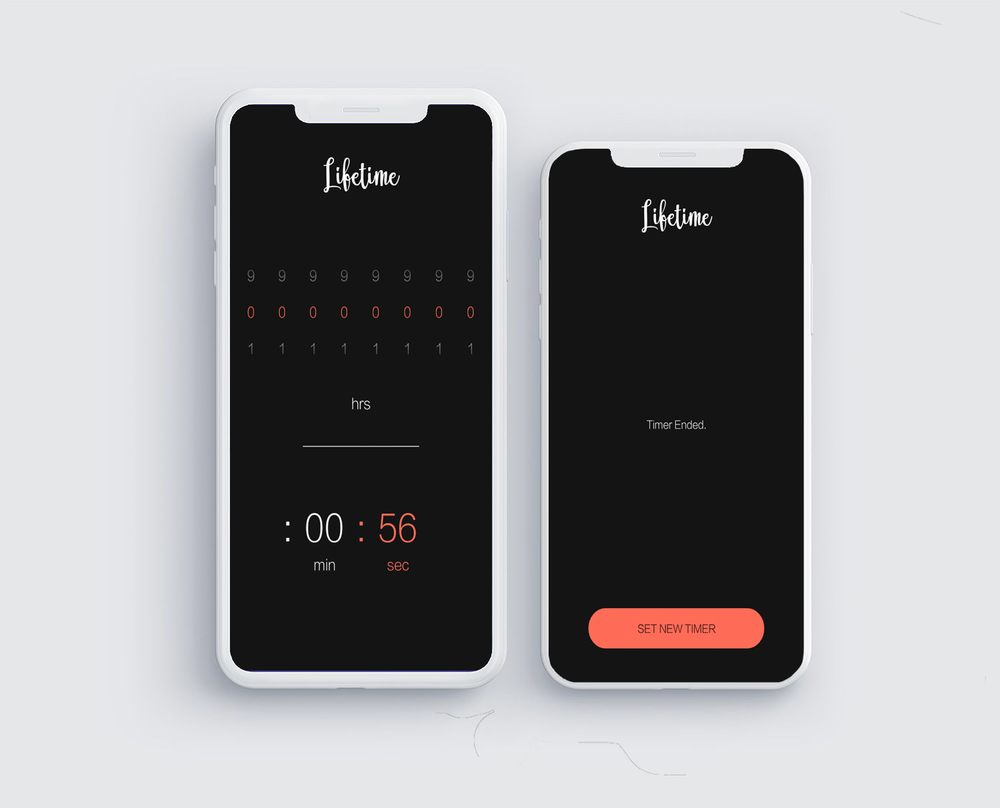

Lifetime
=========
A minimalist immutable timer application for android. I have no idea why I made this.

## Usage
* Clone the repository
* Open it in Android Studio and hit build.
* After 2 decaydes when the Gradle build finishes run the application

## Demo
Uploading soon

## Contribution
Feel free to make changes.
